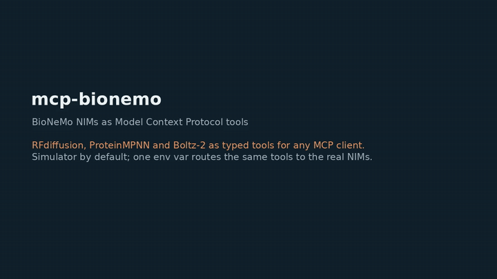

# mcp-bionemo

**A Model Context Protocol (MCP) server for NVIDIA BioNeMo biology NIMs.** It exposes RFdiffusion, ProteinMPNN and Boltz-2 as typed MCP tools, so any MCP client (Claude Desktop, Cursor, an IDE agent, or NeMo Agent Toolkit's own MCP client) can discover and call them like any other tool. It runs against a deterministic **simulator by default**, so you can install and explore it with no GPU, no key and no network.

## Demo



The tool tests run against the simulator, then the client configuration that registers the server. The video is on [anhduongvo.github.io](https://anhduongvo.github.io/projects/agentic-tooling/).

## Background

BioNeMo's biology models are available as NeMo Agent Toolkit agent skills and as HTTP NIM endpoints, but not as an MCP server, so an MCP client has no schema to discover them and cannot call them as tools. `mcp-bionemo` wraps the NIM endpoints in MCP tools with typed input schemas. The same tools route to the real NIMs with one environment variable.

## Quickstart

```bash
pip install -e .
# try it with the MCP inspector, or wire it into a client (below). No key needed: it runs the simulator.
```

Point an MCP client at the server over stdio with the command `mcp-bionemo`. For Claude Desktop, add `examples/claude_desktop_config.json` to your config.

## Tools

| Tool | Model | What it does |
|---|---|---|
| `design_backbone` | RFdiffusion | Design a protein backbone against a target (contigs, optional hotspot residues) |
| `design_sequences` | ProteinMPNN | Design amino-acid sequences that fold to a backbone |
| `fold_complex` | Boltz-2 | Co-fold protein chains (and optional ligands), with an optional affinity estimate |
| `design_binder` | RFdiffusion + ProteinMPNN | Backbone then sequences in one call |
| `info` | — | Report the active backend and the available tools |

Fold the binder **together with the target** to score binding; a binder folded alone does not measure binding. The tool docstrings say so.

## Simulated vs live

By default the server uses an in-process simulator that returns well-formed but meaningless structures and scores: it exercises the tool contracts and the orchestration, not the biology. To call the real BioNeMo NIMs, set:

```bash
BIONEMO_BACKEND=live
NGC_API_KEY=nvapi-xxxx                 # free key at https://build.nvidia.com
# or, for a self-hosted NIM:
BIONEMO_BASE_URL=https://health.api.nvidia.com/v1
```

Hosted NIMs return HTTP 202 for long jobs; the client polls the status endpoint until the result is ready.

## Development

```bash
pip install -e ".[dev]"
ruff check .
pytest            # exercises every tool against the simulator
```

## License

Apache-2.0. This project calls NVIDIA BioNeMo NIMs but is not affiliated with or endorsed by NVIDIA.
